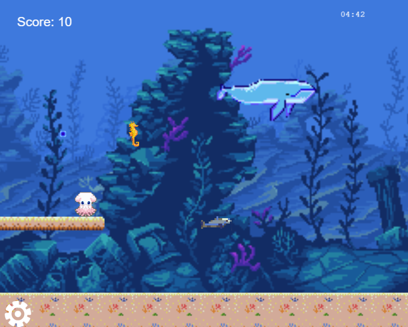
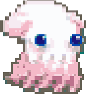
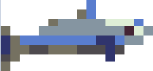
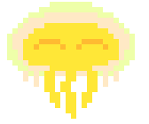
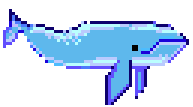
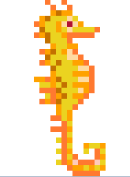
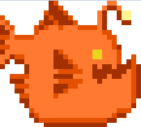
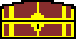
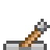

[![Contributors][contributors-shield]][contributors-url]
[![Forks][forks-shield]][forks-url]
[![Stargazers][stars-shield]][stars-url]
[![Issues][issues-shield]][issues-url]

# Shooter Game Pacific Treasures

This game was build using Phaser 3 to learn his functionalities

## Table of Contents

* [Game Instructions](#game-instructions)
* [Live Demo](#demo)
* [Future Implementations](#future-implementations)
* [Built With](#built-with)
* [Testing](#testing)
* [Templates](#templates)
* [Design Credits](#design-credits)
* [Contributing](#contributing)
* [Acknowledgments](#acknowledgments)
* [Authors](#author)
* [License](#license)

## Game Instructions

### Installation

- You can get a local copy of the repository please run the following commands on your terminal:
```
$ cd <folder>
$ git clone git@github.com:Stricks1/shooterGame.git
```
- Open your terminal and go for the folder you copied
- Run the command 'npm run-script start' and it will build and open the game at your browser

Alternatively you can play online on the [Live Demo](#demo)

### Game Concept

On this game, you are Bob the octopus, and you are in a quest to find a treasure in the 16-bit layout deep sea. You need to face some sea creatures in order to achieve your goal. You have 5 minutes to complete the quest.



### How to play

- To move our character you should use the left and arrow keys on your keyboard.
- You can jump with the up arrow key, you can do one extra jump while on air performing a 'double jump'.
- To shoot an 'ink bullet' you should press the space key on your keyboard.

#### Bob the hero



- This is our hero, he dies if hit by any enemy.

#### Enemies



- The Dolphin is our basic enemy. Moves left/right and dies after being hit once by our shoot.



- The Jelly is a simple enemy that moves up/down and dies on 1 hit.



- The Whale moves left/right. To kill the whale you need to hit 3 times.



- The Sea Horse is an aggressive enemy. Moves left/right and shoot a bubble that can kill our hero, be careful! Dies after being hit once



- This fish is also an aggressive enemy. Moves left/right and shoot a bold that can kill our hero. To kill it you need to hit twice.


#### Interactive Scenario



- Our goal is to reach the chest, as soon as we got it we finish our quest. The seconds you had left on the clock are then converted into points (Each second worth 5 points at the end).



- At some points, you will face a wall of seaweed. In order to open that wall, you need to activate the lever. You can do it by touching or shooting it.


## Demo

[Live Demo](https://phaserseagame.herokuapp.com)

## Future Implementations

- I plan to add more stages for the game
- I will add some more images for the background (already added some interesting pngs on the assets to be used on improvements).
- Add more enemies with different behavior.

## Built With
- Javascript
- HTML
- Phaser 3
- Webpack
- Leaderboard API

## Testing

- Test made with Jest.

You can run test running npm test on console at the folder

## Templates

- To create the game I used 2 different templates that helped improve the project. They are the basic template for Phaser 3 [you can find here](https://github.com/photonstorm/phaser3-project-template) created by Richard Davey. Another template I used that implemented some help functionalities to render and align my characters from [William Clarkson](https://williamclarkson.net).

## Design Credits

- The background used is from free assets on [itch io](https://ansimuz.itch.io/underwater-fantasy-pixel-art-environment)
- Most sea creatures are also from free assets you can find it [here](https://rapidpunches.itch.io/)
- The main character octopus is a twitch mascot from [hicelina](https://www.twitch.tv/hicelina) the original art creator is [Michael Perez](https://pixelfly.artstation.com/).

## Contributing

Contributions, issues and feature requests are welcome!

You can do it on [issues page](issues/).

## Acknowledgments

Special thanks to code reviewers.

## Show your support

Give a ⭐️ if you like this project!

## Author

👤 **Gabriel Malheiros Silveira**

- Github: [@Stricks1](https://github.com/Stricks1)
- Linkedin: [Gabriel Silveira](https://linkedin.com/in/gabriel-malheiros-silveira/)
- Twitter: [@Gabriel_Stricks](https://twitter.com/Gabriel_Stricks)

## License

<strong>Creative Commons 2020</strong>

<!-- MARKDOWN LINKS & IMAGES -->

[contributors-shield]: https://img.shields.io/github/contributors/stricks1/shooterGame.svg?style=flat-square
[contributors-url]: https://github.com/stricks1/shooterGame/graphs/contributors
[forks-shield]: https://img.shields.io/github/forks/stricks1/shooterGame.svg?style=flat-square
[forks-url]: https://github.com/stricks1/shooterGame/network/members
[stars-shield]: https://img.shields.io/github/stars/stricks1/shooterGame.svg?style=flat-square
[stars-url]: https://github.com/stricks1/shooterGame/stargazers
[issues-shield]: https://img.shields.io/github/issues/stricks1/shooterGame.svg?style=flat-square
[issues-url]: https://github.com/stricks1/shooterGame/issues